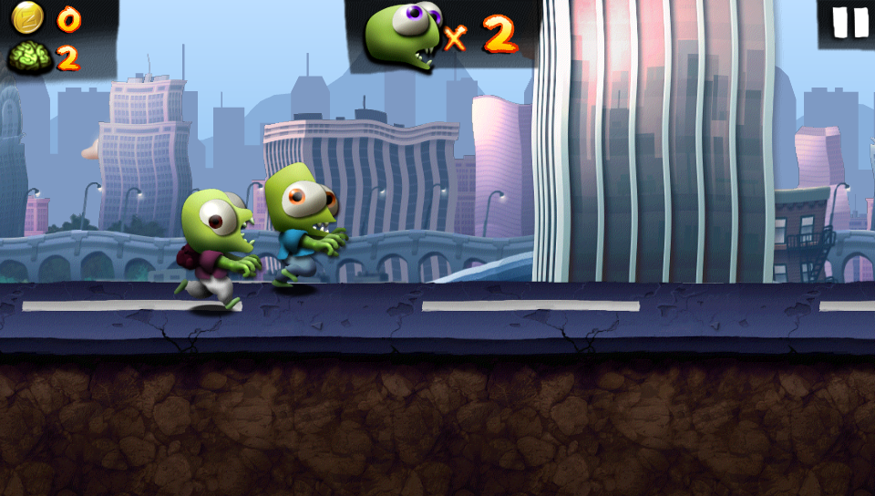
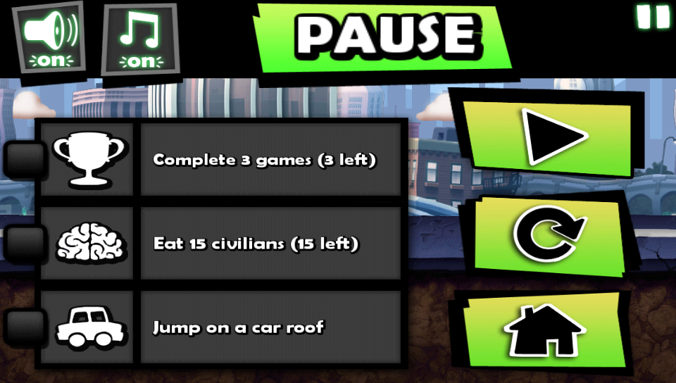
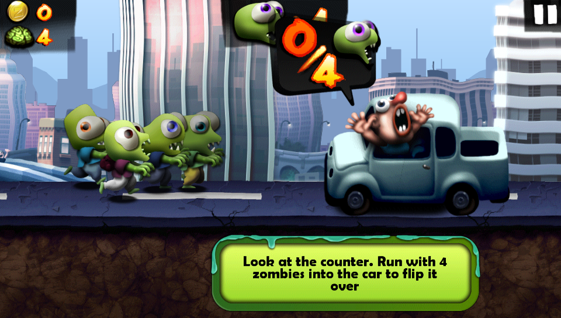
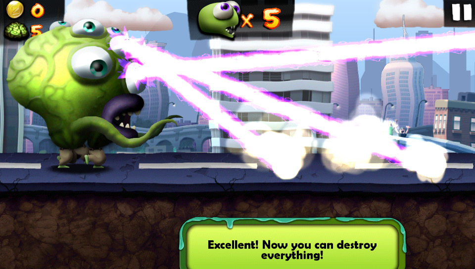
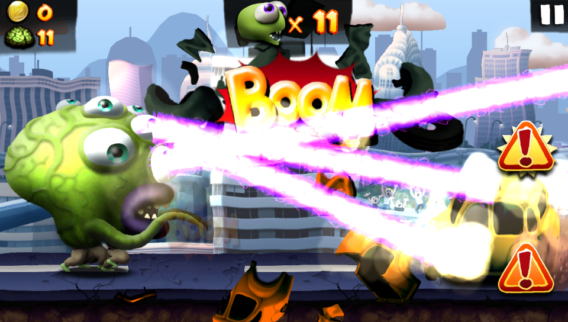
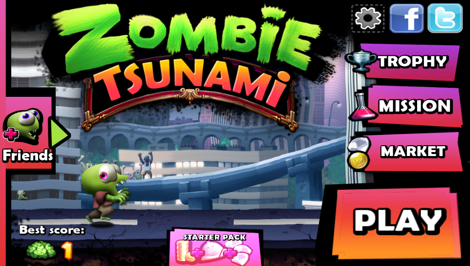

<p align="center">
  
</p>

# Zombie Tsunami — PS Vita Port

Unofficial port of **Zombie Tsunami** for PlayStation Vita, based on the Android version of the game and run via **so-loader**.

> Port by **MeninoSung**  
> Patcher by **WolffsRoom**

## About the port

This project was developed using the so-loader boilerplate and [VitaGL](https://github.com/rinnegatamante/vitagl), an OpenGL library for PlayStation Vita created by Rinnegatamante. The Zombie Tsunami APK was analyzed using artificial intelligence, and after several compilations, tests, and attempts, it was possible to adapt the game to run on the PS Vita.

This port does not distribute the game's commercial data. Users must provide their own compatible APK; the patcher extracts the necessary data and applies the modifications prepared for the Vita.

## Requirements

- Unlocked PlayStation Vita;
- VitaShell or another compatible file manager;
- [ZombieTsunami-v1.0.vpk](https://github.com/WolffsRoom/ZombieTsunami-Vita/releases/download/v1.0/ZombieTsunami-v1.0.vpk);
- [Patcher v1.0](https://github.com/WolffsRoom/ZombieTsunami-Vita/releases/download/v1.0/Patcher.v1.0.zip);
- A compatible APK for **Zombie Tsunami 1.6.0**.

### Supported APK

| Property | Value |
|---|---|
| Game | Zombie Tsunami |
| Version | 1.6.0 |
| SHA-256 | `B73B109B0FCCDFF8296DA8FE1FE12CCEEEAB17F7DAEE9FE53E229E438299AD42` |

The patcher checks the APK's size and SHA-256 hash before starting. Other versions are not accepted, as they may contain libraries or resources that are incompatible with the port.

## How to Generate the Game Files

1. Open the `Release/Patcher v1.0` folder.
2. Place only one compatible APK inside the `APK` folder.
3. Run `ZombieTsunamiPatcher.exe`.
4. Select the interface language.
5. Review the detected APK and confirm to start the process.
6. Wait for the verification and generation to reach 100%.
7. Upon completion, the patcher will create the following folder:

   ```text
   VitaFiles/zombietsunami
   ```

The patcher offers an interface in English, Brazilian Portuguese, Spanish, French, European Portuguese, Italian, Russian, and Japanese.

## Installation on PS Vita

1. Install `ZombieTsunami-v1.0.vpk` using VitaShell.
2. Copy the `zombietsunami` folder generated by the patcher to `ux0:data/`.
3. Verify that the files are located at this path:

   ```text
   ux0:data/zombietsunami/
   ```

4. Launch **Zombie Tsunami** from the LiveArea.

The expected result includes the modified libraries (`libcgame.so`, `libfmodevent.so`, and `libfmodex.so`) and the assets folder used by the game.

## Controls

The game is controlled entirely via the PS Vita touchscreen, preserving the gameplay style of the mobile version.

| Control | Action |
|:---:|---|
| Touchscreen | Controls the entire interface and game actions |
|  | Pauses the game |
| **START** | Pauses the game |

## Screenshots

<p align="center">
  
  
  
  
  
  
  
</p>

## Known Issues

- Some interfaces can freeze the game. For example, opening **Starter Pack**—which originally redirects to the Google Play Store—causes the game to become unresponsive.

## Legal Notice

This is an unofficial, free, non-commercial port. **Zombie Tsunami** and all its features belong to their respective developers and copyright holders.

This repository must not be used to distribute commercial APKs or game data. Please use only legally obtained files and support the original developers.

## Credits

- **Port by MeninoSung**
- **Patcher by WolffsRoom**
- Boilerplate and loader base: **so-loader**
- Graphics rendering: [VitaGL by Rinnegatamante](https://github.com/rinnegatamante/vitagl)
- Original game: their respective developers and rights holders

## Use of Artificial Intelligence

Artificial intelligence tools (Codex ChatGPT) were used to analyze the APK, assist in investigating incompatibilities, and support the iterative compilation and testing process. Full functionality was achieved after several attempts and adjustments to the port.
